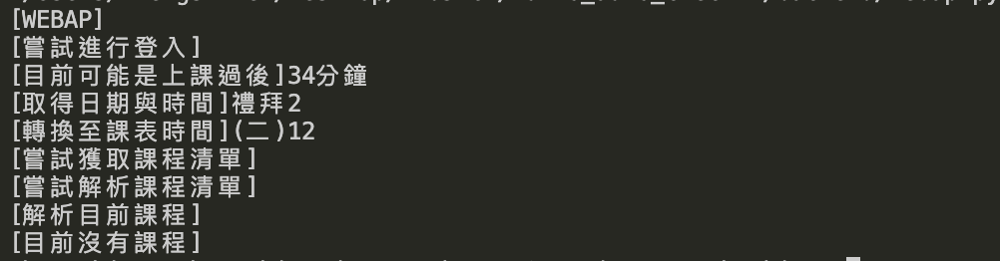
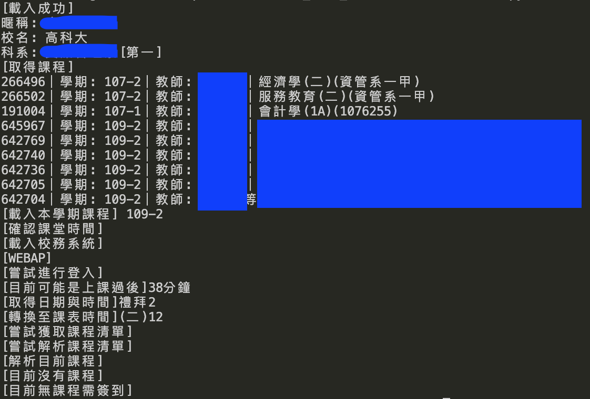

## Server Usage
Run handleapi.py
```bash
sudo python3 handleapi.py
```
If you wnat run this server on localhost or test, please remove 
```python
    ssl_context=('ssl/nginx.crt', 'ssl/nginx.key')
```
at handleapi.py file line 35, and replace https://bikehub.54ucl.com:5252 to your domain name or ip(127.0.0.1) in chrome/content.js file.

---
## webap.py test
```bash
sudo python3 webap.py
```
check webap.py line 177,
```python
test = WEBAP('stdId', 'password', '109-2')
# 109-2 is what semester you choise.
# year-semester(1 or 2...)
# if you want to get more, check this value in webap.
```
replace stdId and password to your school account information.
### webap result


---
## zuvio.py test
```bash
sudo python3 zuvio.py
```
check zuvio.py line 152,
```python
ZUVIO('@nkust.edu.tw', 'password', '109-2')
# 109-2 is what semester you choise.
# year-semester(1 or 2...)
# Please check your student id is upper.
# c -> C
# c1070000001 -> C1070000001
```
### zuvio result


---
## checkIn.py
this file is shown how to call zuvio.py function to run check-in actions, when you want to build a checkIn Server.