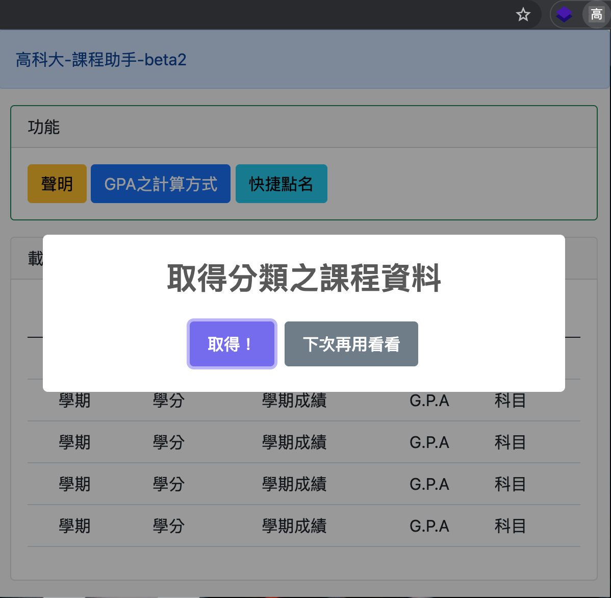
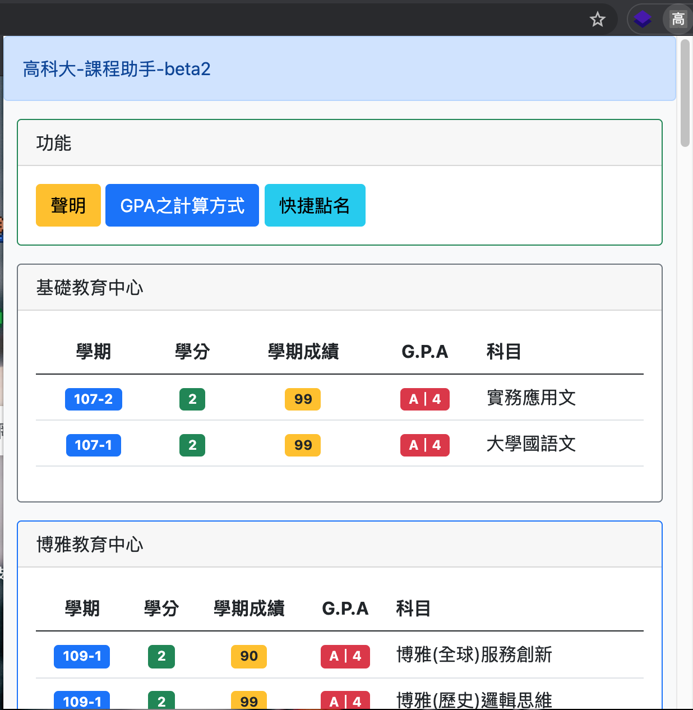
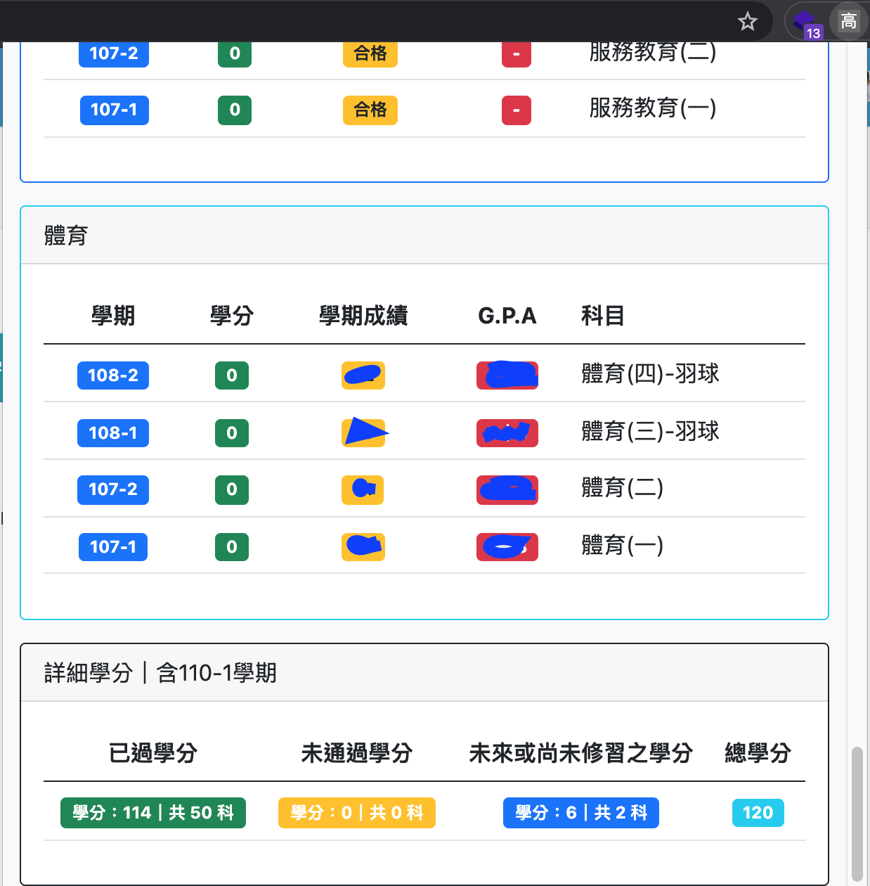
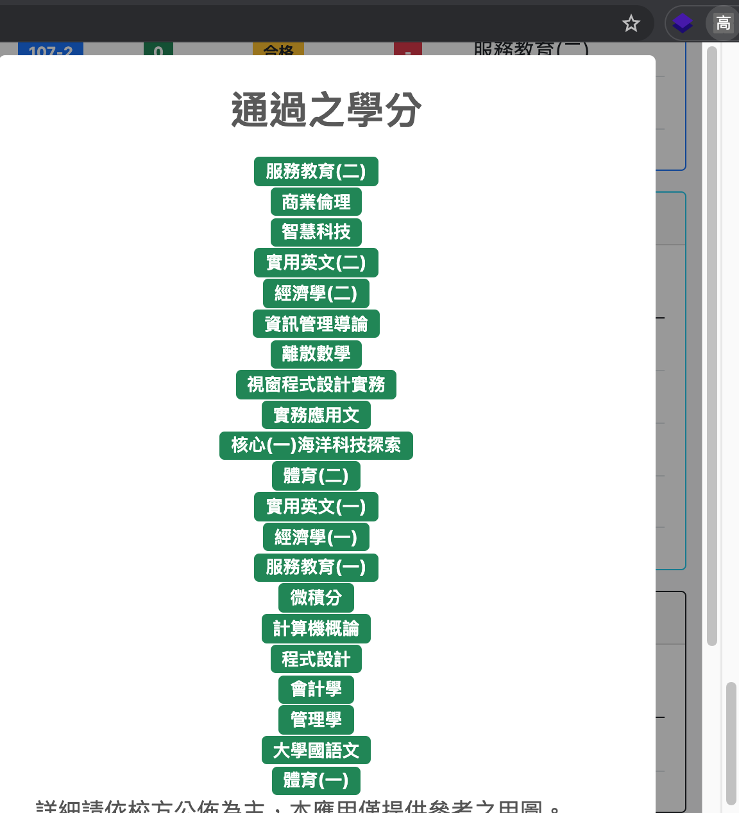
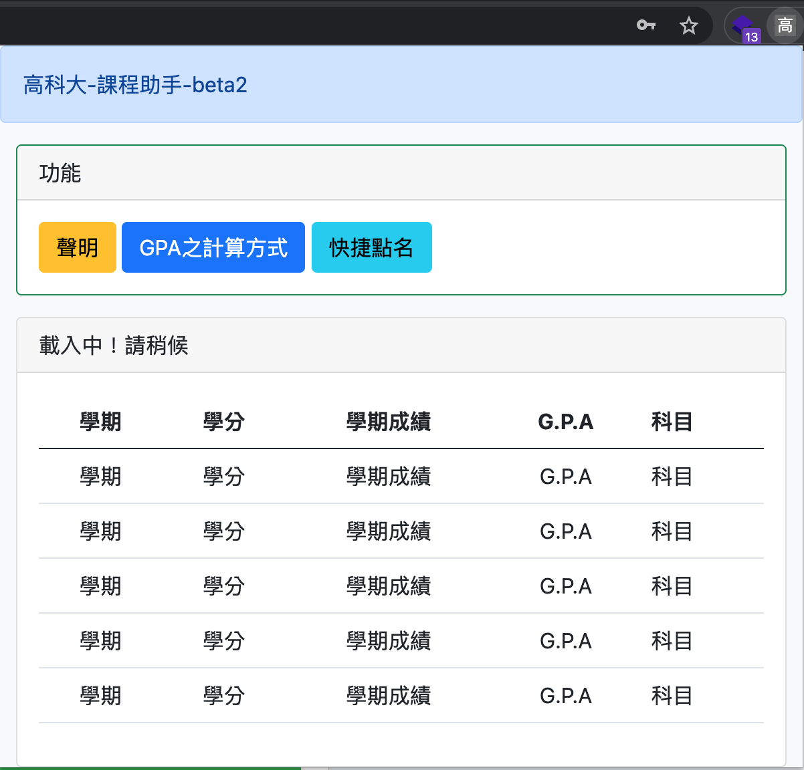
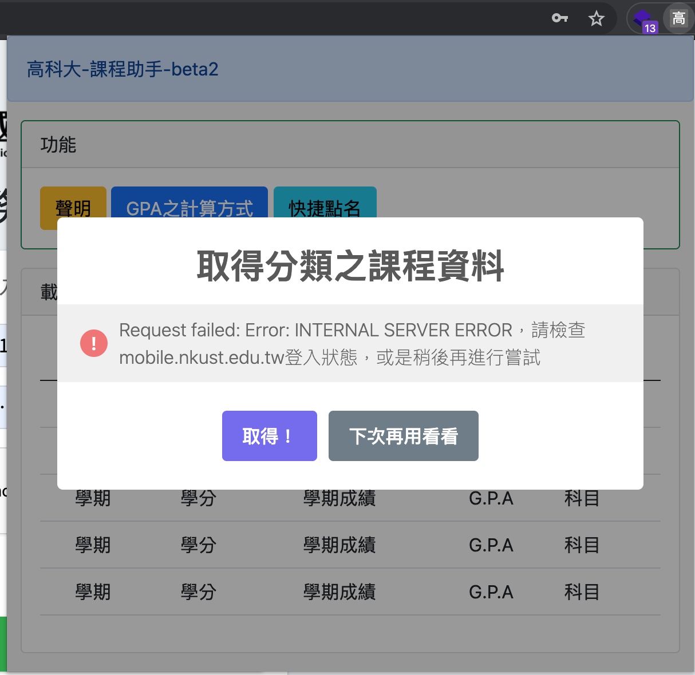
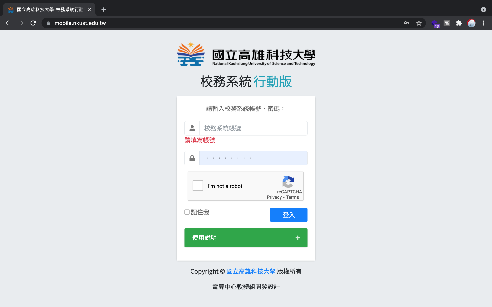
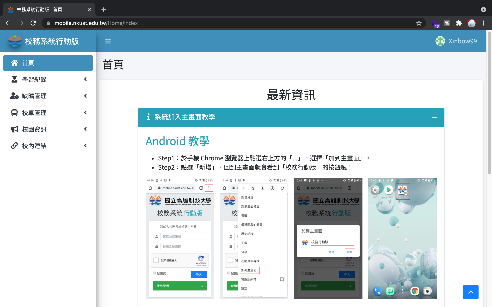

# NKUST Assistant

NKUST-Assistant is a crawler application for NKUST.

## Installation
Open your chrome extensions page(chrome://extensions/) and click Load Unpacked button. If you still couldn’t find the button, you should open the Developer mode in chrome extensions page. Finally you can select chrome.zip to load unpacked extension.

## Usage
### Open the extension

### After click "取得"

This page can show your courses information from your school timetable.
### Credits informaction

And you can get your credits information.

## Problem
### No notification show in extension page when you open that.

###Alert message is shown requests failed.

### Solve.Please check your mobile.nkust.edu.tw status is logged.

